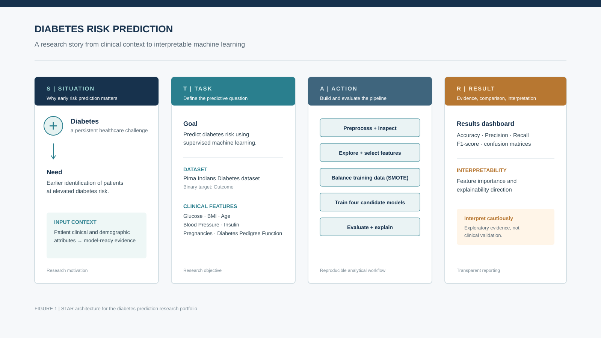
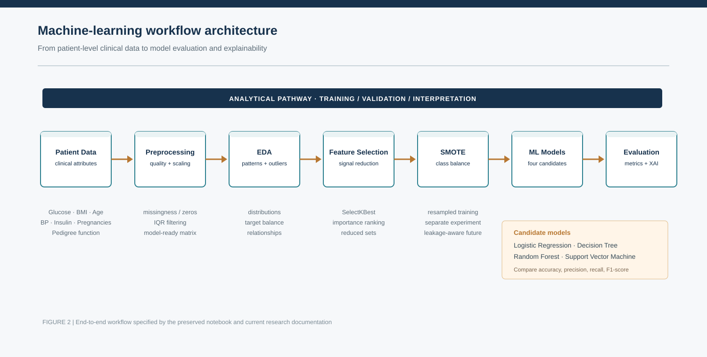
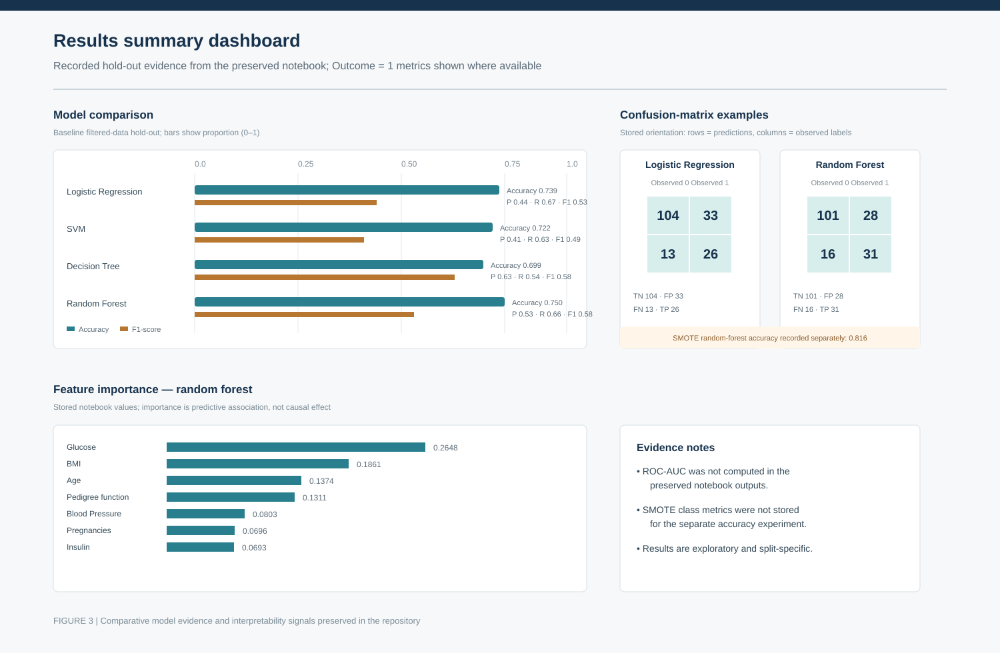
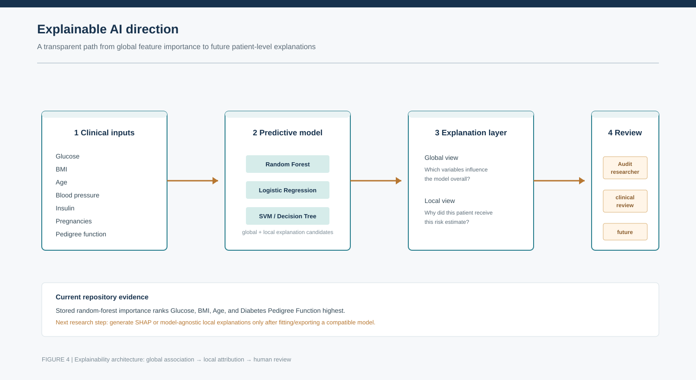

# Diabetes Prediction Using Machine Learning

Research portfolio for an exploratory machine-learning study of diabetes outcome prediction using clinical and demographic features.

## Project Visualization

The figures below present the complete research story using the STAR structure: healthcare motivation, predictive objective, analytical workflow, recorded results, and an explainability path. They are designed as research-communication artifacts and do not add or replace any modeling results.

*Figure 1. STAR architecture connecting the healthcare situation, research task, machine-learning action, and evidence-oriented result interpretation.*

*Figure 2. End-to-end workflow from patient clinical data through preprocessing, EDA, feature selection, SMOTE experimentation, model training, evaluation, and explainability.*

*Figure 3. Results dashboard using the repository’s preserved hold-out metrics, confusion-matrix examples, random-forest feature importance, and explicit evidence notes for unavailable metrics.*

*Figure 4. Explainable AI direction showing how global feature importance can extend toward local attributions and human review after a compatible fitted model is available.*

## Research question

How effectively can standard supervised-learning models distinguish diabetes outcomes in the included dataset, and which features contribute most to model performance?

## Repository structure

~~~text
data/       Source dataset used by the notebook
notebooks/  Reproducible exploratory analysis and modeling notebook
src/        Space for reusable project code as the study is extended
results/    Extracted metrics, tables, and research figures
docs/       Research question, methodology, results, and future-work notes
reports/    Presentation and exported HTML research artifacts
~~~

## Research Objective

The project investigates how machine-learning models can support accurate and interpretable early diabetes risk prediction from clinical attributes. The current work is an exploratory research study using the included dataset; it is not a validated clinical decision-support system.

## Analysis workflow

The notebook documents the current research workflow:

- dataset inspection and data-quality checks
- exploratory visualization and outlier filtering
- class-balance inspection and SMOTE experimentation
- train/test evaluation of logistic regression, SVM, and tree-based models
- random-forest cross-validation
- univariate feature selection and feature-importance analysis

The analysis is intentionally retained in its original notebook form. Results should be interpreted as an educational/research investigation, not as clinical validation or a diagnostic system.

## Getting started

Create an environment and install the dependencies:

~~~bash
python -m venv .venv
source .venv/bin/activate       # Windows: .venv\\Scripts\\activate
pip install -r requirements.txt
~~~

Launch Jupyter from the repository root:

~~~bash
jupyter notebook notebooks/diabetes_prediction_modeling.ipynb
~~~

The notebook reads the dataset from data/diabetes.csv using a repository-relative path.

## Methodology

The preserved notebook performs dataset inspection, data-quality checks, exploratory visualization, sequential IQR-based outlier filtering, class-balance assessment, SMOTE experimentation, stratified hold-out evaluation, random-forest cross-validation, and feature-selection analysis. See docs/methodology.md for the research-method summary and important validation caveats.

## Results Summary

Extracted evidence is available in results/model_comparison.csv and results/evaluation_metrics.csv. The baseline hold-out results show that the random forest had the highest recorded baseline accuracy (0.7500), while the SMOTE random-forest hold-out experiment recorded 0.8162 accuracy. These values are dataset- and split-specific, and ROC-AUC was not computed in the existing notebook outputs.

Visual evidence is provided in results/feature_importance_random_forest.svg, the baseline confusion-matrix plots, and results/roc_auc_comparison.svg. The figures are extracted or reconstructed from the notebook's stored evidence and are not a substitute for external validation.

## Reproducibility and limitations

- Several notebook cells use model defaults and unseeded random splits; exact metrics may vary between runs.
- The notebook contains both the original imbalanced-data experiments and subsequent SMOTE experiments. Resampling strategy and validation design should be revisited before drawing conclusions.
- The dataset provenance, cohort definition, and clinical applicability should be documented further before publication.
- This repository does not provide medical advice and must not be used for patient-level decisions.

## Research artifacts

The reports/ directory contains the existing exported analysis HTML and presentation. Generated figures, tables, and additional reports can be added under results/ and reports/ without changing the source notebook.

## Explainable AI Direction

The src/explainability.py module provides optional SHAP integration, model-agnostic explanation utilities, and feature-importance helpers. The current repository does not contain a serialized fitted model, so SHAP values must be generated in a future execution after fitting or exporting a model with compatible feature data.

## Future Research

Priority next steps include leakage-safe resampling within cross-validation, fixed random seeds, calibration and threshold analysis, fairness evaluation across relevant subgroups, external validation on larger clinical datasets, and prospective assessment of workflow and deployment risks. See docs/future_work.md.

## License and data use

No license has been added yet. Before public distribution, add an appropriate code license and document the dataset license/provenance and any applicable privacy or redistribution constraints.
